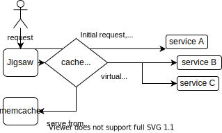

## Recap: What is jigsaw?

_UI composition layer_

- NGINX web server <!-- .element: class="fragment" data-fragment-index="0" -->
- Micro frontend`s with SSI (Server Side Include) <!-- .element: class="fragment" data-fragment-index="1" -->
- Fragment and asset caching <!-- .element: class="fragment" data-fragment-index="2" -->
- Google Pagespeed module <!-- .element: class="fragment" data-fragment-index="3" -->

<!-- vertical -->

### How it works

 <!-- .element: style="width:100%; background-color:#fff" -->

<!-- section -->

## The cookie problem


<!-- vertical -->

### Cookies at AutoScout24

_There is still a scrollbar..._


<!-- vertical -->

### Why cookies crash the pages

- Request with large cookies reaches different services
- Each fragment request can lead to a broken page
- Different max header size limit per service

<!-- vertical -->

### Cookie size != header size

A typical browser request includes multiple headers

`base 350 bytes + cookie header 4500 bytes (home page)`

```ht
GET / HTTP/1.1
Host: www.autoscout24.de
User-Agent: Mozilla/5.0 (X11; Linux x86_64; rv:82.0) Gecko/20100101 Firefox/82.0
Accept: text/html,application/xhtml+xml,application/xml;q=0.9,image/webp,*/*;q=0.8
Accept-Language: de-DE,de;q=0.8,en-US;q=0.5,en;q=0.3
Accept-Encoding: br, gzip, deflate
DNT: 1
Upgrade-Insecure-Requests: 1
Connection: keep-alive
+
Cookie: optimizelyEndUserId=o............
```

<!-- section -->

### Known http/1.x header limits

- AWS Cloudfront: Total request limit of **20 K** (path + query string + headers)
- S3: Total header request limit of **8192 bytes**
- AWS ELB: single header: **16 K**, whole header: **64 K**
- NGINX/Jigsaw: request headers up to **21 K**
- NodeJS: Default max header limit of **8192** bytes
- Java/Scala and the play framework: Defaults to **8192** bytes (not validated)
<!-- vertical -->

## Mitigation

- Jigsaw header limits are very high (21K) configured
- Jigsaw has been configured to prevent sending cookie headers to **S3**
- Services should never set cookies at **root path** `/`!
- Services can increase max header size at their side
- Anything else to avoid blowing the cookie

<!-- section -->

## HTTP/2

Jigsaw/Nginx does only make `http/1.x` calls to the proxy upstream/backend. All requests between Cloudfront, jigsaw and the specific backend should remain with `http/1.x`.

```text
Browser
http/2 | http/1.x
    -> Cloudfront
       http/1.x
          -> AWS Classic ELB
             http/1.x
              -> Jigsaw/Nginx
                 http/1.x
                    -> AWS ELB
                       http/1.x
                        -> service application
```

<!-- vertical -->

### Cookies in HTTP/2

**HTTP/2** and the Cookie header field is treated specially by the HTTP mapping ([see RFC 7540 Section 8.1.2.5](https://tools.ietf.org/html/rfc7540#section-8.1.2.5)).

> To allow for better compression efficiency, the Cookie header field MAY be split into separate header fields, each with one or more cookie-pairs

<!-- section -->

# Thank you!

**Richard Hillmann**

_Senior Platform Engineer_
